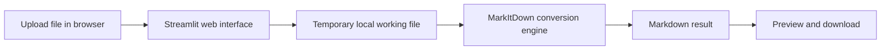

# MarkItDown Web UI

MarkItDown Web UI is a local Streamlit interface for the [MarkItDown](https://github.com/microsoft/markitdown) conversion engine. It provides a simple browser-based workflow for turning documents such as PDF, DOCX, PPTX, XLSX, images, and audio files into Markdown for LLM, search, and knowledge-management workflows.


## Overview

This project packages a lightweight web front end around [MarkItDown](https://github.com/microsoft/markitdown) so files can be converted without using the command line directly. The application is designed for local use and emphasizes straightforward setup, predictable file handling, and a clear conversion flow.

## Key Capabilities

- Browser-based interface built with Streamlit
- Local document conversion through MarkItDown
- Drag-and-drop upload flow for common file types
- Markdown output that can be reviewed and downloaded immediately
- Temporary file cleanup after processing
- Configurable upload limits to protect local system resources

## Supported File Types

The current web UI accepts the following file types directly through the browser picker:

- Documents: PDF, DOCX, PPTX, XLSX, EPUB, MSG, ZIP
- Web and structured text: HTML, HTM, CSV, JSON, JSONL, XML
- Plain text and Markdown: TXT, TEXT, MD, MARKDOWN
- Notebooks: IPYNB
- Images: JPG, JPEG, PNG
- Audio and video: WAV, MP3, M4A, MP4

The underlying MarkItDown engine supports a broader set of formats and integrations when the relevant optional dependencies are installed. In this repository, `markitdown[all]` is included in the root requirements, so the backend engine is provisioned with broad converter support and the current UI now exposes a larger subset of those local file-based converters.

## How It Works



## Privacy and Local Processing

The application is intended for local-first use. Files are processed on the local machine through the MarkItDown engine rather than being sent to a public conversion API. Uploaded files are written to temporary local storage with generated identifiers instead of relying on the original filename, which reduces path and naming conflicts. Temporary working files are removed after processing completes.

## Project Structure

This repository is an extended clone of the upstream MarkItDown project. The root contains the Streamlit web UI, while the `packages/` directory retains the upstream Python packages and related extensions.

```text
markitdown-web-ui/
├── .devcontainer/
├── .github/
├── .streamlit/
│   └── config.toml
├── app.py
├── Dockerfile
├── packages/
│   ├── markitdown/
│   ├── markitdown-mcp/
│   ├── markitdown-ocr/
│   └── markitdown-sample-plugin/
├── README.md
├── requirements.txt
└── screenshot.JPG
```

For this project, this structure is more accurate than a minimal single-app layout because the repository is not just a standalone Streamlit app; it also vendors the upstream MarkItDown workspace that the UI depends on and extends.

## Requirements

- Python 3.10 or later
- A virtual environment such as `.venv`

## Installation

```bash
git clone https://github.com/k-f-m/markitdown-web-ui.git
cd markitdown-web-ui
```

```bash
python -m venv .venv
```

On Windows:

```bash
.venv\Scripts\activate
```

On macOS or Linux:

```bash
source .venv/bin/activate
```

```bash
pip install -r requirements.txt
```

## Running the Application

```bash
streamlit run app.py
```

After startup, open `http://localhost:8501` in your browser if Streamlit does not open it automatically.

## Typical Workflow

1. Start the Streamlit application.
2. Upload a supported file through the web interface.
3. Run the conversion.
4. Review the generated Markdown.
5. Download or copy the result for downstream use.

## Known Limitations

- The current Streamlit upload whitelist is still narrower than the full MarkItDown engine capability.
- The UI focuses on local file-based conversions and does not expose URL-driven or service-backed flows such as YouTube URLs or Azure-backed conversion paths.
- Some accepted file types may depend on optional native tools or libraries at runtime for best results, even though `markitdown[all]` is installed.

## Notes

- This repository is an independent web UI wrapper around the upstream [MarkItDown](https://github.com/microsoft/markitdown) project.
- It is not officially affiliated with or endorsed by Microsoft.
- The software is provided under the MIT License.

## License

This project is distributed under the MIT License. See the `LICENSE` file for details.