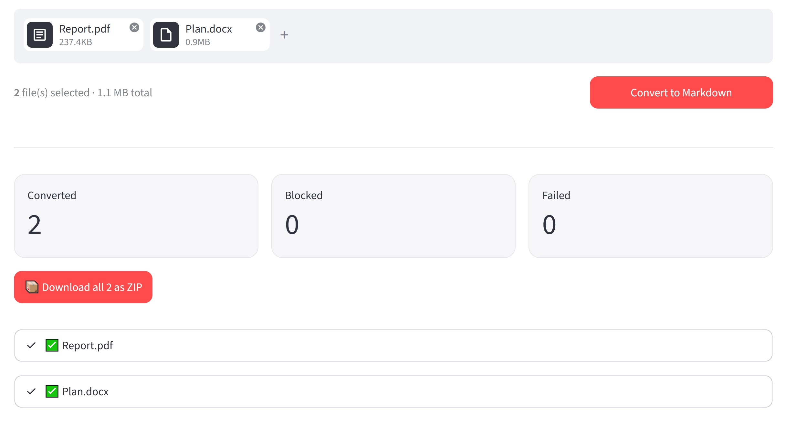
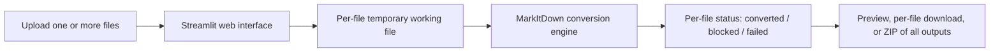

# MarkItDown Web UI

MarkItDown Web UI is a local, privacy-first Streamlit interface for the [MarkItDown](https://github.com/microsoft/markitdown) conversion engine. Drop in your documents, spreadsheets, notebooks, and images and get clean Markdown back — one file or a whole batch at once — ready for LLM, RAG, search, and knowledge-management workflows.



## Why use it

- **Local by default:** Conversions run on your machine; anything that could leave it is off until you opt in.
- **Batch friendly:** Convert many files in a single run and download them all as one ZIP.
- **Zero command line:** A clean browser UI with drag-and-drop, live progress, and per-file results.
- **Honest about trade-offs:** Paths that may call a third party are clearly labeled and disabled by default.

## Overview

This project packages a lightweight web front end around [MarkItDown](https://github.com/microsoft/markitdown) so files can be converted without using the command line directly. The application is designed for local use and emphasizes straightforward setup, predictable file handling, and a clear conversion flow.

## Key Capabilities

- Browser-based interface built with Streamlit
- Local document conversion through MarkItDown
- Drag-and-drop upload for one or many files at once
- Live progress and a per-file status card (converted, blocked, or failed)
- Individual Markdown downloads plus a single ZIP of all successful outputs
- A settings sidebar with explicit opt-in toggles for any non-local path
- ZIP archives inspected before conversion to honor your privacy choices
- Optional LLM-vision OCR for images embedded in PDF, DOCX, PPTX, and XLSX (opt-in)
- Temporary file cleanup after each run
- Configurable upload limits to protect local system resources

## Supported File Types

The current web UI exposes the following local file types by default through the browser picker:

- Documents: PDF, DOCX, PPTX, XLSX, EPUB, MSG, ZIP
- Web and structured text: HTML, HTM, CSV, JSON, JSONL, XML
- Plain text and Markdown: TXT, TEXT, MD, MARKDOWN
- Notebooks: IPYNB
- Images: JPG, JPEG, PNG

Audio and video formats are available only after an explicit opt-in toggle in the sidebar:

- Audio and video: WAV, MP3, M4A, MP4

The underlying MarkItDown engine supports a broader set of formats and integrations when the relevant optional dependencies are installed. In this repository, `markitdown[all]` is included in the root requirements, so the backend engine is provisioned with broad converter support and the current UI now exposes a larger subset of those local file-based converters.

ZIP uploads are inspected before conversion. If an archive contains files that would require a conversion path you have not enabled (for example audio or video), that archive is blocked until you turn on the matching opt-in.

## How It Works



## Privacy and Local Processing

The application is intended for local-first use. Files are processed on the local machine through the MarkItDown engine rather than being sent to a public conversion API, except for the opt-in conversion paths described below. Uploaded files are written to a unique temporary directory and processed without using the original file path, which avoids path-traversal and naming conflicts. Temporary working files are removed after processing completes.

Audio and video transcription are treated separately in the UI. Those formats are hidden by default and require an explicit opt-in because the underlying transcription path may send media content to a third-party speech recognition service.

Image OCR is likewise non-local and disabled by default. When enabled, it sends images embedded in your documents to an OpenAI-compatible vision model (see the section below). The API key you provide is held only in memory for the session and is never written to disk or logged.

## Optional: Image OCR (LLM Vision)

Many PDFs, slide decks, and documents contain text that lives inside images (scans, screenshots, charts). The optional OCR path uses the bundled [`markitdown-ocr`](./packages/markitdown-ocr) plugin to extract that text with an OpenAI-compatible vision model.

> **This is a non-local path.** Enabling OCR sends embedded images to whichever endpoint you configure. Only enable it for content you are comfortable sending to that provider. To keep everything on your machine, point **Base URL** at a local OpenAI-compatible server (for example a local vLLM or Ollama endpoint).

**Enable it:**

1. Install the optional dependencies (not included in the default `requirements.txt`):

   ```bash
   pip install ./packages/markitdown-ocr[llm]
   ```

2. In the sidebar, open **Image OCR (LLM Vision)** and turn it on.
3. Set the vision model (default `gpt-4o`), an optional Base URL for OpenAI-compatible or local endpoints, and your API key.
4. Convert as usual. OCR applies only to PDF, DOCX, PPTX, and XLSX files; other formats are unaffected.

If OCR is left off, or a key is not provided, documents are converted locally without OCR.

## Project Structure

This repository is an extended clone of the upstream MarkItDown project. The root contains the Streamlit web UI, while the `packages/` directory retains the upstream Python packages and related extensions.

```text
markitdown-web-ui/
├── .devcontainer/
├── .github/
├── .streamlit/
│   └── config.toml
├── app.py
├── Dockerfile
├── packages/
│   ├── markitdown/
│   ├── markitdown-mcp/
│   ├── markitdown-ocr/
│   └── markitdown-sample-plugin/
├── README.md
├── requirements.txt
└── screenshot.JPG
```

For this project, this structure is more accurate than a minimal single-app layout because the repository is not just a standalone Streamlit app; it also vendors the upstream MarkItDown workspace that the UI depends on and extends.

## Requirements

- Python 3.10 or later
- A virtual environment such as `.venv`

## Installation

```bash
git clone https://github.com/k-f-m/markitdown-web-ui.git
cd markitdown-web-ui
```

```bash
python -m venv .venv
```

On Windows:

```bash
.venv\Scripts\activate
```

On macOS or Linux:

```bash
source .venv/bin/activate
```

```bash
pip install -r requirements.txt
```

## Running the Application

```bash
streamlit run app.py
```

After startup, open `http://localhost:8501` in your browser if Streamlit does not open it automatically.

## Typical Workflow

1. Start the Streamlit application.
2. (Optional) Open the sidebar to review settings and enable any non-local opt-in you need.
3. Drag and drop one or more supported files onto the uploader.
4. Click **Convert to Markdown** and watch the per-file progress.
5. Review each result in its status card, then download files individually or grab everything as a single ZIP.

For audio and video files, enable the transcription opt-in in the sidebar and review the privacy warning before uploading.

## Known Limitations

- The current Streamlit upload whitelist is still narrower than the full MarkItDown engine capability.
- The UI focuses on local file-based conversions and does not expose URL-driven or service-backed flows such as YouTube URLs or Azure-backed conversion paths.
- Audio and video transcription are opt-in because the current backend path may rely on third-party speech recognition rather than fully local processing.
- ZIP archives that contain audio or video files are blocked unless the transcription opt-in is enabled.
- Image OCR is opt-in and non-local: when enabled it sends embedded images to an OpenAI-compatible vision endpoint and requires an API key.
- Some accepted file types may depend on optional native tools or libraries at runtime for best results, even though `markitdown[all]` is installed.

## Notes

- This repository is an independent web UI wrapper around the upstream [MarkItDown](https://github.com/microsoft/markitdown) project.
- It is not officially affiliated with or endorsed by Microsoft.
- The software is provided under the MIT License.

## License

This project is distributed under the MIT License. See the `LICENSE` file for details.